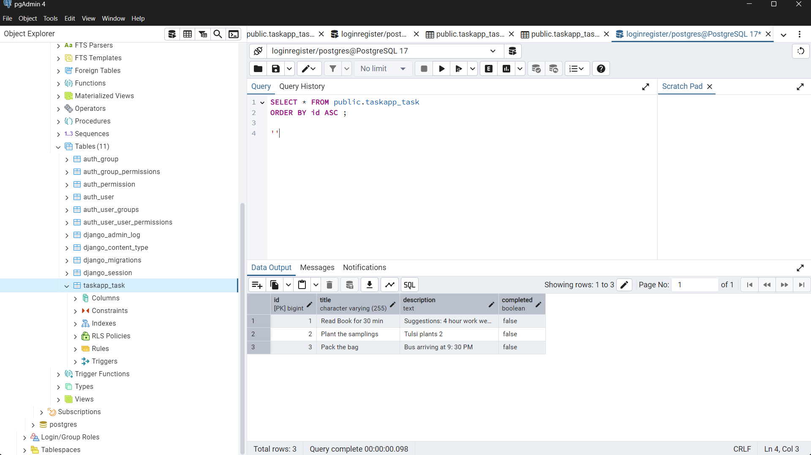

# Assignment for Junior Developer Role

## List of Assignments:

### Task 1: Unique Words in a Sentence
- **Description:** Write a Python program to find the unique words in the given sentence.
- **Solution Location:** `coding_questions/unique_words.py`

---

### Task 2: Optimize Function
- **Description:** Rewrite the function to reduce time complexity.
- **Solution Location:** `coding_questions/duplicates.py`

---

### Task 3: Build a Simple API Using Flask (or Django)
- **Description:** Create an API with the following endpoints:
  1. **POST /tasks** - Add a new task
  2. **GET /tasks** - Get all tasks
  3. **PUT /tasks/<task_id>** - Update a task
  4. **DELETE /tasks/<task_id>** - Delete a task
  5. **Store tasks in a list or a database.**
  6. **Ensure error handling (e.g., task not found, invalid input).**

### Project Structure
- There are two projects in the `todoapp_django` folder:
  1. **taskapp:** Contains the main project with the listed endpoints.
  2. **todolist:** API based on user sessions with endpoints like GET, POST, DELETE.

---

## 1. taskapp

### Steps to Run the Project:

1. **Navigate to the Project:**

   ```sh
   cd todoapp_django

   python manage.py runserver 

### The API Endpoints as follows for the taskapp

#### 1. GET /tasks → Get all tasks
    ```sh
    Navigate to: http://127.0.0.1:8000/api/    


#### 2. POST /tasks → Add a new task 

Navigate to: /api/tasks/create that will re-route to the create page where you can add new task

```
http://127.0.0.1:8000/api/tasks/create/
```

#### 3. PUT /tasks/<task_id> → Update a task

Navigate to: add /api/tasks/update/int:<id>/  that will re-route to the update page where you can toggle the task to its completion

```
http://127.0.0.1:8000/api/tasks/update/int:<id>/
```


#### 4. DELETE /tasks/<task_id> → Delete a task
Navigate to: /api/tasks/delete/int:<id>/  that will re-route to the delete page where we get a page asking for confirmation to delete the task
```
http://127.0.0.1:8000/api/tasks/delete/int:<id>/

```


#### 5. Store tasks in a list (or a database if comfortable).

### The data is stored in the PostgreSQL



##### Database Config()

```bash

{ 
  'ENGINE': 'django.db.backends.postgresql',
  'NAME': 'loginregister', 
}

```

6. Ensure error handling (e.g., task not found, invalid input).
Implemented try and Except for the functions used in veiws.py 

``` py

def update_task(request, id):
    try: 
        task = get_object_or_404(Task, id=id)

        if request.method == 'POST':
            task.completed = True
            task.save()
            return redirect('home')
    except Exception as e:
        print(f'Updated faild: Due to Error {e}')
    
    return render(request, 'content/update_task.html', {'task': task})

```

